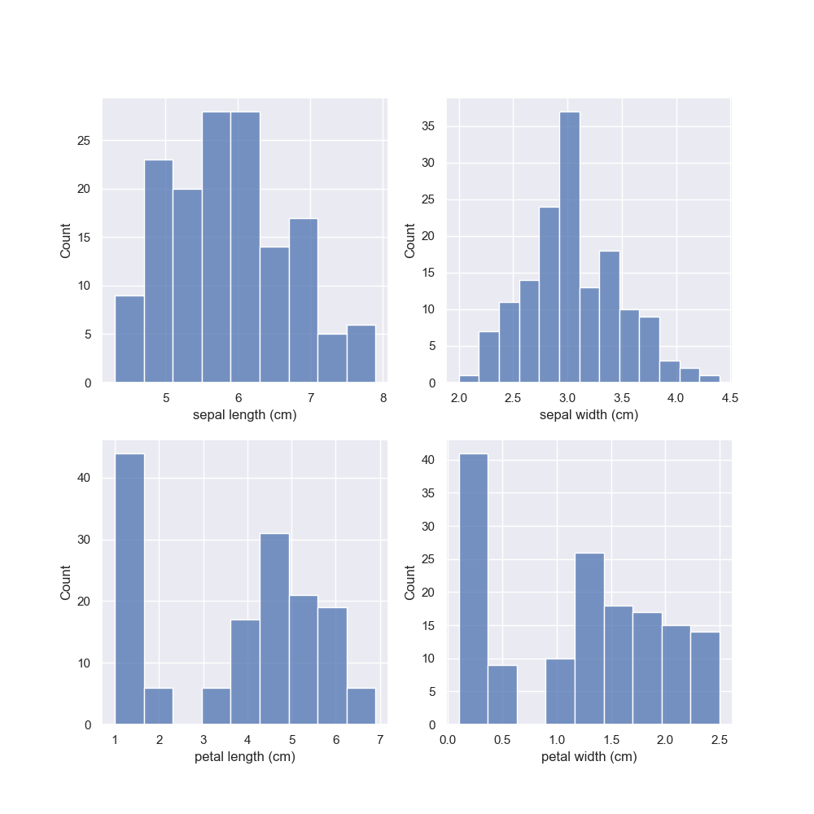
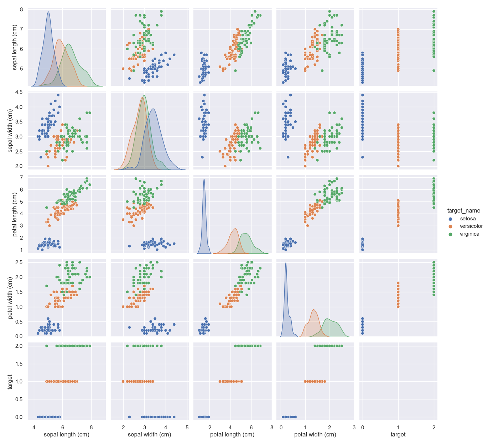
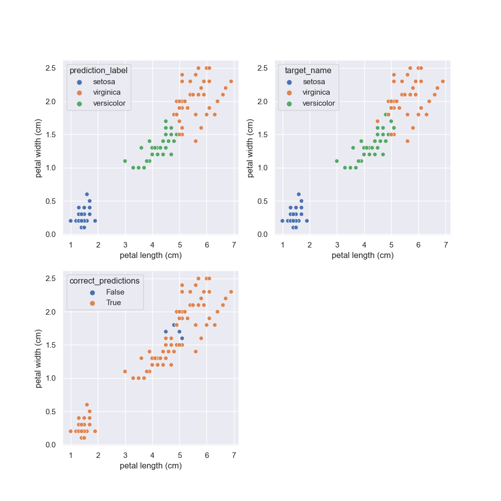
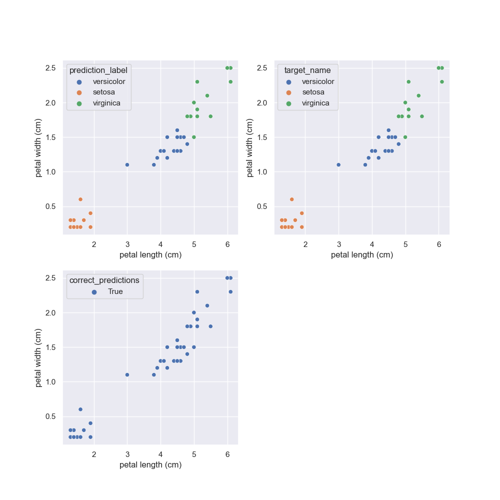

# The-Classic-IRIS-Dataset
## Using the following  Libraries 
- pandas
- scikit-learn (sklearn)
- matplotlib
- seaborn

## Some of the machine learning models, used in this Repo:
- logistic regression
- train test split
- cross validation
### Plotting Histogram of features

### Plotting Each Pair of features

### Plotting Incorrect predicts of Training set


### Plotting Incorrect predicts of Test set


## Conclusion  
- ```Accuracy :96.78%  for C = 10``` for training data
- ```Accuracy :97.37% for C = 10``` for test data
```
        precision    recall  f1-score   support
             0       1.00      1.00      1.00        14
             1       1.00      0.90      0.95        10
             2       0.93      1.00      0.97        14

      accuracy                           0.97        38
     macro avg       0.98      0.97      0.97        38
  weighted avg       0.98      0.97      0.97        38
```